```julia
using Pkg
pkg"registry add https://github.com/JuliaRegistries/General"
pkg"registry add https://github.com/vincentcp/FrameFunRegistry"
Pkg.activate(pwd());Pkg.instantiate()
ENV["JULIA_DEBUG"]=""
```

       Cloning registry from "https://github.com/JuliaRegistries/General"
    [?25h[1mFetching: [========================================>]  100.0 %.0 %Fetching: [=====>                                   ]  10.2 %Fetching: [=====>                                   ]  10.8 %Fetching: [=====>                                   ]  11.4 %Fetching: [=====>                                   ]  12.0 %Fetching: [======>                                  ]  12.6 %Fetching: [======>                                  ]  13.2 %Fetching: [======>                                  ]  13.8 %Fetching: [======>                                  ]  14.2 %Fetching: [======>                                  ]  14.8 %Fetching: [=======>                                 ]  15.4 %Fetching: [=======>                                 ]  16.1 %Fetching: [=======>                                 ]  16.4 %Fetching: [=======>                                 ]  16.5 %Fetching: [=======>                                 ]  16.9 %Fetching: [=======>                                 ]  17.3 %Fetching: [========>                                ]  17.6 %Fetching: [========>                                ]  17.8 %Fetching: [========>                                ]  17.9 %Fetching: [========>                                ]  18.1 %Fetching: [========>                                ]  18.6 %Fetching: [========>                                ]  19.0 %Fetching: [========>                                ]  19.4 %Fetching: [========>                                ]  19.5 %Fetching: [========>                                ]  19.6 %Fetching: [========>                                ]  19.7 %Fetching: [========>                                ]  19.8 %Fetching: [========>                                ]  19.9 %Fetching: [=============>                           ]  30.1 %Fetching: [=============>                           ]  30.3 %Fetching: [=============>                           ]  30.5 %Fetching: [=============>                           ]  30.7 %Fetching: [=============>                           ]  31.0 %Fetching: [=============>                           ]  31.8 %Fetching: [=============>                           ]  32.3 %Fetching: [==============>                          ]  32.6 %Fetching: [==============>                          ]  33.1 %Fetching: [==============>                          ]  33.4 %Fetching: [==============>                          ]  33.7 %Fetching: [==============>                          ]  33.9 %Fetching: [==============>                          ]  34.2 %Fetching: [==============>                          ]  35.0 %Fetching: [===============>                         ]  35.4 %Fetching: [===============>                         ]  35.7 %Fetching: [===============>                         ]  35.9 %Fetching: [===============>                         ]  36.2 %Fetching: [===============>                         ]  36.6 %Fetching: [===============>                         ]  36.8 %Fetching: [===============>                         ]  37.1 %Fetching: [===============>                         ]  37.4 %Fetching: [================>                        ]  38.3 %Fetching: [================>                        ]  38.7 %Fetching: [================>                        ]  39.2 %Fetching: [================>                        ]  39.7 %Fetching: [=====================>                   ]  50.1 %Fetching: [=====================>                   ]  50.5 %Fetching: [=====================>                   ]  50.9 %Fetching: [=====================>                   ]  51.6 %Fetching: [=====================>                   ]  52.3 %Fetching: [======================>                  ]  52.8 %Fetching: [======================>                  ]  53.3 %Fetching: [======================>                  ]  53.8 %Fetching: [======================>                  ]  54.4 %Fetching: [=======================>                 ]  55.4 %Fetching: [=======================>                 ]  55.6 %Fetching: [=======================>                 ]  56.2 %Fetching: [=======================>                 ]  56.9 %Fetching: [========================>                ]  57.9 %Fetching: [========================>                ]  58.4 %Fetching: [========================>                ]  59.1 %Fetching: [========================>                ]  59.9 %Fetching: [=============================>           ]  70.8 %Fetching: [=============================>           ]  71.8 %Fetching: [==============================>          ]  72.9 %Fetching: [==============================>          ]  73.9 %Fetching: [===============================>         ]  75.4 %Fetching: [===============================>         ]  76.5 %Fetching: [================================>        ]  77.5 %Fetching: [================================>        ]  78.7 %Fetching: [================================>        ]  79.7 %Fetching: [=====================================>   ]  92.0 %Fetching: [======================================>  ]  93.1 %Fetching: [======================================>  ]  94.3 %Fetching: [=======================================> ]  95.9 %Fetching: [=======================================> ]  96.8 %

    ┌ Info: registry `General` already exist in `~/.julia/registries/General`.
    └ @ Pkg.Types /Users/sabae/buildbot/worker/package_macos64/build/usr/share/julia/stdlib/v1.3/Pkg/src/Types.jl:1049


       Cloning registry from "https://github.com/vincentcp/FrameFunRegistry"
    [?25hActivating environment at `~/NextCloud/git/AZnotebook/Project.toml`>                                   ]  11.4 %27.5 %>                      ]  43.7 %              ]  62.6 % [================================>        ]  78.8 %Fetching: [====================================>    ]  89.4 %


    ┌ Info: registry `FrameFun General` already exist in `~/.julia/registries/FrameFun General`.
    └ @ Pkg.Types /Users/sabae/buildbot/worker/package_macos64/build/usr/share/julia/stdlib/v1.3/Pkg/src/Types.jl:1049


    ""


```julia
using LinearAlgebra, DomainSets, BasisFunctions, FrameFun, Plots, PGFPlotsX, Statistics, 
    LaTeXStrings, DocumentPGFPlots
opts = (samplingstyle=OversamplingStyle(), samplingfactor=2, normalizedsampling=true, 
    solverstyle=AZStyle(), threshold=1e-10,REG=pQR_solver)
@pgf sizeopts = {height=140,width=300}
@pgf axisopts = {ymode="log",ymax=1e4,ymin=1e-20,sizeopts...}
@pgf plotopts = {color="black",mark_options="fill=black",mark_size="1pt"}
```


    PGFPlotsX.Options(OrderedCollections.OrderedDict{Any,Any}("color" => "black","mark_options" => "fill=black","mark_size" => "1pt"), true)


    ┌ Warning: /Users/vincentcp/.julia/packages/Plots/B2J6j/src/Plots.jl/ is not an existing directory, Revise is not watching
    └ @ Revise /Users/vincentcp/.julia/packages/Revise/SZ4ae/src/Revise.jl:489


```julia
D = UnionDomain((-0.75)..(-0.25),0.0..0.5)
P = ExtensionFramePlatform(platform(Fourier(1)→(-1.0..1.0)),D)
N = 50
F = Fun(exp,P,N)
x = PeriodicEquispacedGrid(4N,-1,1)
B = Fourier(N)→(-1.0..1.0)
y = real.(F(x))
yy = real.(Expansion(B,coefficients(F))(x));
m1 = x .∈ Ref(D.domains[1]);
m2 = x .∈ Ref(D.domains[2]);
G = @pgf Axis({cycle_list_name="mark list",
        xlabel=L"N",
        legend_pos="north east",height=140,width=300},
    Plot({no_marks,style="black,dashed,thin"},Table(x,y)),
    Plot({no_marks,style="black,very thick"},Table(x[m1],yy[m1])),
    Plot({no_marks,style="black,very thick"},Table(x[m2],yy[m2])),
)
```


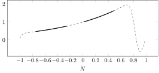


```julia
G = @pgf Axis({cycle_list_name="mark list",
        xlabel=L"N",
        legend_pos="north east",height=140,width=300},
    Plot({only_marks,style="black"},Table(1:N,svdvals(AZ_A(P,N;normalizedsampling=true))))
    )
```


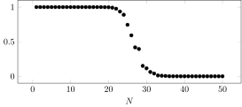


# Fourier extension


```julia
P = ExtensionFramePlatform(platform(Fourier(10)→(-1.0..1.0)) ,-.5..0.5)
f = x->x
N = 201
```


    201


```julia
P
```


    ExtensionFramePlatform(FrameFun.Platforms.ModelPlatform(Dictionary M(F)
    
    M	:	Mapping from 0.0..1.0 (Unit) to -1.0..1.0
    F	:	Fourier series
    		    ↳ length = 10
    		    ↳ Float64 -> Complex{Float64}
    		    ↳ support = 0.0..1.0 (Unit)
    ), -0.5..0.5)


```julia
fA = @pgf Axis(axisopts,PlotInc(plotopts,Table([collect(1:N),
                svdvals(AZ_A(P, N;opts...,normalizedsampling=false))])))
```


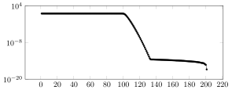


```julia
fZ = @pgf Axis(axisopts,PlotInc(plotopts,Table([collect(1:N),
                svdvals(AZ_Zt(P, N;opts..., normalizedsampling=false))])))
```


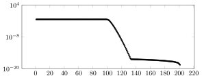


```julia
fM = @pgf Axis(axisopts,PlotInc(plotopts,Table([collect(1:N),svdvals(plungematrix(P,N;opts...,normalizedsampling=false))])))
```


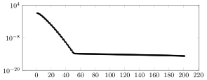


```julia
using  Statistics
ns1 = [1<<k for k in 4:16]
ns2 = [1<<k for k in 4:11]
t = [getindex(@timed(approximate(exp,P,n;opts...)),2) for n in ns1,  i in 1:3]
t1 = [getindex(@timed(approximate(exp,P,n;opts...,solverstyle=DirectStyle(),
                    directsolver=:qr)),2) for n in ns2,  i in 1:3];
```


```julia
fT = @pgf Axis({sizeopts..., xmode="log",ymode="log",legend_pos="south east"},
    PlotInc({plotopts...,mark_size=2,forget_plot},Table([ns1,median(t,dims=2)[:]])),
    PlotInc({plotopts...,mark_size=2,forget_plot},Table([ns2,median(t1,dims=2)[:]])),
    PlotInc({plotopts..., style="black,dashed",mark="none"},
        Table([ns1,1e-5ns1.*log10.(ns1)])),
    LegendEntry(L"\mathcal O(N \log^2(N))"))
```


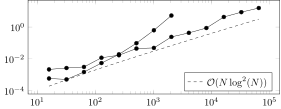


# Legendre extension


```julia
using FrameFun, BasisFunctions
import FrameFun.Platforms: dictionary
import FrameFun.FrameFunInterface: discretemeasure
struct WLegendrePlatform <: BasisPlatform end
FrameFun.Platforms.unsafe_dictionary(plat::WLegendrePlatform, param::Int) = Legendre(param)
FrameFun.Platforms.correctparamformat(platform::WLegendrePlatform, param::Int) = true
discretemeasure(ss::SamplingStyle, plat::WLegendrePlatform, param, ap; options...) =
    gauss_rule(dictionary(plat,length(sampling_grid(ss,ap;options...))));
```


```julia
P = FrameFun.ExtensionFramePlatform(WLegendrePlatform(), Interval(-.5,.5))
N = 201;
```


```julia
A = AZ_A(P,N; opts...,normalizedsampling=false)
```


    Operator D * R[𝕀 → 𝕀] * M
    
    𝕀	:	[403, 404, 405  …  802, 803, 804]
    R	:	Restriction of coefficients to subset
    M	:	Multiplication by Array{Float64,2}
    D	:	Diagonal operator with element type Float64
    		    ↳ [0.04750799100792431, 0.047543482742518184, 0.04757878694373602  …  0.04757878694373602, 0.047543482742518184, 0.04750799100792431]


```julia
lA = @pgf Axis(axisopts,PlotInc(plotopts,Table([collect(1:N),svdvals(AZ_A(P, N;opts...))])))
```


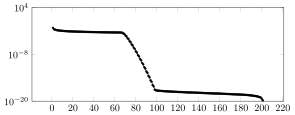


```julia
azdual_dict(P,10)
```


    Dictionary 𝔼(D * L)
    
    𝔼	:	Extension frame, from -0.5..0.5 to -1.0..1.0 (Chebyshev)
    L	:	Legendre polynomials
    		    ↳ length = 10
    		    ↳ Float64 -> Float64
    		    ↳ support = -1.0..1.0 (Chebyshev)
    D	:	Diagonal operator with element type Float64
    		    ↳ [0.5000000000000002, 1.5000000000000004, 2.500000000000001  …  7.500000000000008, 8.500000000000014, 9.500000000000023]


```julia
Z = AZ_Z(P,N; opts...,normalizedsampling=false)
```


    Operator D₁ * R[𝕀 → 𝕀] * M * D₂
    
    𝕀	:	[403, 404, 405  …  802, 803, 804]
    R	:	Restriction of coefficients to subset
    M	:	Multiplication by Array{Float64,2}
    D₂	:	Diagonal operator with element type Float64
    		    ↳ [0.49999999999999956, 1.4999999999999984, 2.500000000000001  …  198.49999999999983, 199.5000000000003, 200.50000000000065]
    D₁	:	Diagonal operator with element type Float64
    		    ↳ [0.04750799100792431, 0.047543482742518184, 0.04757878694373602  …  0.04757878694373602, 0.047543482742518184, 0.04750799100792431]


```julia
Zt = AZ_Zt(P,N; opts...,normalizedsampling=false)
```


    Operator D₁ * M * E[ 𝕀 → 𝕀] * D₂
    
    𝕀	:	[403, 404, 405  …  802, 803, 804]
    M	:	Multiplication by Adjoint{Float64,Array{Float64,2}}
    E	:	Extending coefficients by zero padding
    D₂	:	Diagonal operator with element type Float64
    		    ↳ [0.04750799100792431, 0.047543482742518184, 0.04757878694373602  …  0.04757878694373602, 0.047543482742518184, 0.04750799100792431]
    D₁	:	Diagonal operator with element type Float64
    		    ↳ [0.49999999999999956, 1.4999999999999984, 2.500000000000001  …  198.49999999999983, 199.5000000000003, 200.50000000000065]


```julia
lZ = @pgf Axis(axisopts,PlotInc(plotopts,Table([collect(1:N),svdvals(Zt)])))
```


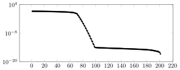


```julia
lM = @pgf Axis(axisopts,PlotInc(plotopts,Table([collect(1:N),svdvals(A-A*Zt*A)])))
```


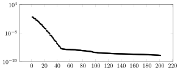


```julia

```


```julia
P = FrameFun.OPSExtensionFramePlatform(Legendre(10),Interval(-.5..0.5))
N = 201;
```


```julia
A = AZ_A(P,N; opts...)
```


    Operator D * R[𝕀 → 𝕀] * M
    
    𝕀	:	[403, 404, 405  …  802, 803, 804]
    R	:	Restriction of coefficients to subset
    M	:	Multiplication by Array{Float64,2}
    D	:	Diagonal operator with element type Float64
    		    ↳ [0.04750799100792431, 0.047543482742518184, 0.04757878694373602  …  0.04757878694373602, 0.047543482742518184, 0.04750799100792431]


```julia
wlA = @pgf Axis(axisopts,PlotInc(plotopts,Table([collect(1:N),svdvals(A)])))
```


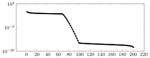


```julia
Zt = AZ_Zt(P,N; opts...)
```


    Operator M₁ * M₂ * E[ 𝕀 → 𝕀] * D
    
    𝕀	:	[403, 404, 405  …  802, 803, 804]
    M₂	:	Multiplication by Adjoint{Float64,Array{Float64,2}}
    M₁	:	Multiplication by Adjoint{Float64,Array{Float64,2}}
    E	:	Extending coefficients by zero padding
    D	:	Diagonal operator with element type Float64
    		    ↳ [21.049090453713365, 21.033377075375654, 21.017769981873297  …  21.017769981873297, 21.033377075375654, 21.049090453713365]


```julia
wlZ = @pgf Axis({axisopts...,ymax=1e4},PlotInc(plotopts,Table([collect(1:N),svdvals(Zt)])))
```


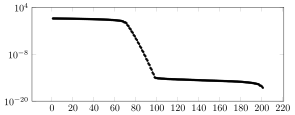


```julia
wlM = @pgf Axis(axisopts,PlotInc(plotopts,Table([collect(1:N),svdvals(A-A*Zt*A)])))
```


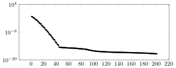


```julia

```


```julia

```

# Chebyshev extension


```julia
using FrameFun, BasisFunctions
import FrameFun.Platforms: dictionary
import FrameFun.FrameFunInterface: discretemeasure
struct WChebyshevPlatform <: BasisPlatform end
FrameFun.Platforms.unsafe_dictionary(plat::WChebyshevPlatform, param::Int) = ChebyshevT(param)
FrameFun.Platforms.correctparamformat(platform::WChebyshevPlatform, param::Int) = true
discretemeasure(ss::SamplingStyle, plat::WChebyshevPlatform, param, ap; options...) =
    gauss_rule(dictionary(plat,length(sampling_grid(ss,ap;options...))));
```


```julia
P = FrameFun.ExtensionFramePlatform(WChebyshevPlatform(), Interval(-.5,.5))
N = 201;
```


```julia
A = AZ_A(P,N; opts...)
```


    Operator α * R[𝕀 → 𝕀] * iDCT * D * E[ 𝕀 → 1:201]
    
    𝕀	:	[403, 404, 405  …  802, 803, 804]
    α	:	Scaling by 0.0026049690328273575
    iDCT	:	FFTW in-place IDCT (DCT-III) plan for 1206-element array of Float64
    R	:	Restriction of coefficients to subset
    E	:	Extending coefficients by zero padding
    D	:	Diagonal operator with element type Float64
    		    ↳ [34.72751070837068, -24.55605831561735, 24.55605831561735  …  -24.55605831561735, 24.55605831561735, -24.55605831561735]


```julia
cA = @pgf Axis(axisopts,PlotInc(plotopts,Table([collect(1:N),svdvals(AZ_A(P, N;opts...))])))
```


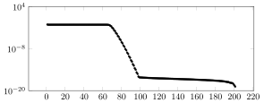


```julia

```


```julia
Zt = AZ_Zt(P,N; opts...)
```


    Operator D₁ * R[1:201 → 𝕀] * D₂ * DCT * E[ 𝕀 → 𝕀] * D₃
    
    𝕀	:	[403, 404, 405  …  802, 803, 804]
    R	:	Restriction of coefficients to subset
    E	:	Extending coefficients by zero padding
    D₃	:	Diagonal operator with element type Float64
    		    ↳ [1.0, 1.0, 1.0  …  1.0, 1.0, 1.0]
    D₂	:	Diagonal operator with element type Float64
    		    ↳ [34.72751070837068, -24.55605831561735, 24.55605831561735  …  -24.55605831561735, 24.55605831561735, -24.55605831561735]
    D₁	:	Diagonal operator with element type Float64
    		    ↳ [0.31830988618379974, 0.6366197723675818, 0.6366197723675813  …  0.6366197723675873, 0.6366197723675854, 0.6366197723675874]
    DCT	:	FFTW in-place DCT (DCT-II) plan for 1206-element array of Float64


```julia
cZ = @pgf Axis(axisopts,PlotInc(plotopts,Table([collect(1:N),svdvals(AZ_Zt(P, N;opts...))])))
```


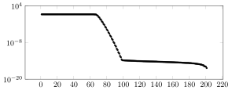


```julia

```


```julia
plungematrix(P,N;opts...)
```


    Operator α₁ * (α₂ - (α₃ * R[𝕀₁ → 𝕀] * iDCT₁ * D₁ * E[ 𝕀 → 1:201] * D₂ * R[1:201 → 𝕀] * D₃ * DCT * E[ 𝕀 → 𝕀₂] * D₄)) * R[𝕀₃ → 𝕀] * iDCT₂ * D₅ * E[ 𝕀 → 1:201]
    
    𝕀₃	:	[403, 404, 405  …  802, 803, 804]
    𝕀₂	:	[403, 404, 405  …  802, 803, 804]
    𝕀₁	:	[403, 404, 405  …  802, 803, 804]
    α₃	:	Scaling by 0.0026049690328273575
    α₂	:	Scaling by 1.0
    α₁	:	Scaling by 0.0026049690328273575
    iDCT₂	:	FFTW in-place IDCT (DCT-III) plan for 1206-element array of Float64
    iDCT₁	:	FFTW in-place IDCT (DCT-III) plan for 1206-element array of Float64
    R	:	Restriction of coefficients to subset
    E	:	Extending coefficients by zero padding
    D₅	:	Diagonal operator with element type Float64
    		    ↳ [34.72751070837068, -24.55605831561735, 24.55605831561735  …  -24.55605831561735, 24.55605831561735, -24.55605831561735]
    D₄	:	Diagonal operator with element type Float64
    		    ↳ [1.0, 1.0, 1.0  …  1.0, 1.0, 1.0]
    D₃	:	Diagonal operator with element type Float64
    		    ↳ [34.72751070837068, -24.55605831561735, 24.55605831561735  …  -24.55605831561735, 24.55605831561735, -24.55605831561735]
    D₂	:	Diagonal operator with element type Float64
    		    ↳ [0.31830988618379974, 0.6366197723675818, 0.6366197723675813  …  0.6366197723675873, 0.6366197723675854, 0.6366197723675874]
    D₁	:	Diagonal operator with element type Float64
    		    ↳ [34.72751070837068, -24.55605831561735, 24.55605831561735  …  -24.55605831561735, 24.55605831561735, -24.55605831561735]
    DCT	:	FFTW in-place DCT (DCT-II) plan for 1206-element array of Float64


```julia
cM = @pgf Axis(axisopts,PlotInc(plotopts,Table([collect(1:N),svdvals(plungematrix(P,N;opts...))])))
```


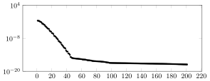


# Weighted on a square


```julia
f = (x,y) -> cos(2pi*(x+y)) + sqrt(x^2+y^2)*sin(1+2pi*(x+y))
```


    #35 (generic function with 1 method)


```julia
P = WeightedSumPlatform(platform(ChebyshevT(10,-1,1)^2), (x,y)->1., (x,y)->sqrt(x^2+y^2))
N = 32;
```

    ┌ Warning: The syntax ChebyshevT(n, a, b) is deprecated. Please use ChebyshevT(n) → a..b instead (the symbol → is \Rightarrow)
    └ @ BasisFunctions /Users/vincentcp/.julia/packages/BasisFunctions/N9rR1/src/bases/poly/chebyshev/ChebyshevT.jl:14


```julia
A = AZ_A(P,((N,N),(N,N)); opts...)
```


    Operator (α₁ ⊗ α₁) * (α₂ ⊗ α₂) * [Ψ₂, 	Ψ₄]
    
    Ψ₄ = D₄ * (Ψ₃)
    
    Ψ₃ = (iDCT₃ * D₅ * E[ 𝕀 → 1:32]) ⊗ (iDCT₄ * D₆ * E[ 𝕀 → 1:32])
    
    Ψ₂ = D₁ * (Ψ₁)
    
    Ψ₁ = (iDCT₁ * D₂ * E[ 𝕀 → 1:32]) ⊗ (iDCT₂ * D₃ * E[ 𝕀 → 1:32])
    
    α₂	:	Scaling by 1.0
    α₁	:	Scaling by 0.21984584296868612
    Ψ₄	:	CompositeOperator
    Ψ₃	:	TensorProductOperator
    Ψ₂	:	CompositeOperator
    Ψ₁	:	TensorProductOperator
    iDCT₄	:	FFTW in-place IDCT (DCT-III) plan for 65-element array of Float64
    iDCT₃	:	FFTW in-place IDCT (DCT-III) plan for 65-element array of Float64
    iDCT₂	:	FFTW in-place IDCT (DCT-III) plan for 65-element array of Float64
    iDCT₁	:	FFTW in-place IDCT (DCT-III) plan for 65-element array of Float64
    E	:	Extending coefficients by zero padding
    D₆	:	Diagonal operator with element type Float64
    		    ↳ [8.06225774829855, -5.70087712549569, 5.70087712549569  …  5.70087712549569, -5.70087712549569, 5.70087712549569]
    D₅	:	Diagonal operator with element type Float64
    		    ↳ [8.06225774829855, -5.70087712549569, 5.70087712549569  …  5.70087712549569, -5.70087712549569, 5.70087712549569]
    D₄	:	Diagonal operator with element type Float64
    		    ↳ [1.4138006319252818, 1.4121505986054352, 1.40886018544396  …  1.40886018544396, 1.4121505986054352, 1.4138006319252818]
    D₃	:	Diagonal operator with element type Float64
    		    ↳ [8.06225774829855, -5.70087712549569, 5.70087712549569  …  5.70087712549569, -5.70087712549569, 5.70087712549569]
    D₂	:	Diagonal operator with element type Float64
    		    ↳ [8.06225774829855, -5.70087712549569, 5.70087712549569  …  5.70087712549569, -5.70087712549569, 5.70087712549569]
    D₁	:	Diagonal operator with element type Float64
    		    ↳ [1.0, 1.0, 1.0  …  1.0, 1.0, 1.0]


```julia
Zt = AZ_Zt(P,((N,N),(N,N)); opts...)
```


    Operator [Ψ₂;	Ψ₄] * (α ⊗ α) * (D₁₁ ⊗ D₁₂)
    
    Ψ₄ = (Ψ₃) * D₁₀
    
    Ψ₃ = (D₆ * R[1:32 → 𝕀] * D₇ * DCT₃) ⊗ (D₈ * R[1:32 → 𝕀] * D₉ * DCT₄)
    
    Ψ₂ = (Ψ₁) * D₅
    
    Ψ₁ = (D₁ * R[1:32 → 𝕀] * D₂ * DCT₁) ⊗ (D₃ * R[1:32 → 𝕀] * D₄ * DCT₂)
    
    α	:	Scaling by 1.0
    Ψ₄	:	CompositeOperator
    Ψ₃	:	TensorProductOperator
    Ψ₂	:	CompositeOperator
    Ψ₁	:	TensorProductOperator
    R	:	Restriction of coefficients to subset
    D₉	:	Diagonal operator with element type Float64
    		    ↳ [8.06225774829855, -5.70087712549569, 5.70087712549569  …  5.70087712549569, -5.70087712549569, 5.70087712549569]
    D₈	:	Diagonal operator with element type Float64
    		    ↳ [0.015384615384615385, 0.03076923076923077, 0.03076923076923077  …  0.03076923076923077, 0.03076923076923077, 0.03076923076923077]
    D₇	:	Diagonal operator with element type Float64
    		    ↳ [8.06225774829855, -5.70087712549569, 5.70087712549569  …  5.70087712549569, -5.70087712549569, 5.70087712549569]
    D₆	:	Diagonal operator with element type Float64
    		    ↳ [0.015384615384615385, 0.03076923076923077, 0.03076923076923077  …  0.03076923076923077, 0.03076923076923077, 0.03076923076923077]
    D₅	:	Diagonal operator with element type Float64
    		    ↳ [0.3334631364343788, 0.3339824490254798, 0.33502105526482434  …  0.33502105526482434, 0.3339824490254798, 0.3334631364343788]
    D₄	:	Diagonal operator with element type Float64
    		    ↳ [8.06225774829855, -5.70087712549569, 5.70087712549569  …  5.70087712549569, -5.70087712549569, 5.70087712549569]
    D₃	:	Diagonal operator with element type Float64
    		    ↳ [0.015384615384615385, 0.03076923076923077, 0.03076923076923077  …  0.03076923076923077, 0.03076923076923077, 0.03076923076923077]
    D₂	:	Diagonal operator with element type Float64
    		    ↳ [8.06225774829855, -5.70087712549569, 5.70087712549569  …  5.70087712549569, -5.70087712549569, 5.70087712549569]
    D₁₂	:	Diagonal operator with element type Float64
    		    ↳ [4.54864184146723, 4.54864184146723, 4.54864184146723  …  4.54864184146723, 4.54864184146723, 4.54864184146723]
    D₁₁	:	Diagonal operator with element type Float64
    		    ↳ [4.54864184146723, 4.54864184146723, 4.54864184146723  …  4.54864184146723, 4.54864184146723, 4.54864184146723]
    D₁₀	:	Diagonal operator with element type Float64
    		    ↳ [0.4714503930147112, 0.47163351531504055, 0.47199782604803153  …  0.47199782604803153, 0.47163351531504055, 0.4714503930147112]
    D₁	:	Diagonal operator with element type Float64
    		    ↳ [0.015384615384615385, 0.03076923076923077, 0.03076923076923077  …  0.03076923076923077, 0.03076923076923077, 0.03076923076923077]
    DCT₄	:	FFTW in-place DCT (DCT-II) plan for 65-element array of Float64
    DCT₃	:	FFTW in-place DCT (DCT-II) plan for 65-element array of Float64
    DCT₂	:	FFTW in-place DCT (DCT-II) plan for 65-element array of Float64
    DCT₁	:	FFTW in-place DCT (DCT-II) plan for 65-element array of Float64


```julia
s = svdvals(A)
wsA = @pgf Axis(axisopts,PlotInc(plotopts,Table([collect(1:length(s)),s])))
```

    ┌ Warning: Reshaping input of tensor product operator from vector to tensor
    └ @ BasisFunctions /Users/vincentcp/.julia/packages/BasisFunctions/N9rR1/src/operator/tensorproductoperator.jl:90
    ┌ Warning: Reshaping input of tensor product operator from vector to tensor
    └ @ BasisFunctions /Users/vincentcp/.julia/packages/BasisFunctions/N9rR1/src/operator/tensorproductoperator.jl:90
    ┌ Warning: Reshaping input of tensor product operator from vector to tensor
    └ @ BasisFunctions /Users/vincentcp/.julia/packages/BasisFunctions/N9rR1/src/operator/tensorproductoperator.jl:90
    ┌ Warning: Reshaping input of tensor product operator from vector to tensor
    └ @ BasisFunctions /Users/vincentcp/.julia/packages/BasisFunctions/N9rR1/src/operator/tensorproductoperator.jl:90


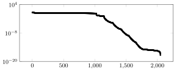


```julia
s = svdvals(Zt)
wsZ = @pgf Axis(axisopts,PlotInc(plotopts,Table([collect(1:length(s)),s])))
```

    ┌ Warning: Reshaping output of tensor product operator from vector to tensor
    └ @ BasisFunctions /Users/vincentcp/.julia/packages/BasisFunctions/N9rR1/src/operator/tensorproductoperator.jl:95
    ┌ Warning: Reshaping output of tensor product operator from vector to tensor
    └ @ BasisFunctions /Users/vincentcp/.julia/packages/BasisFunctions/N9rR1/src/operator/tensorproductoperator.jl:95
    ┌ Warning: Reshaping output of tensor product operator from vector to tensor
    └ @ BasisFunctions /Users/vincentcp/.julia/packages/BasisFunctions/N9rR1/src/operator/tensorproductoperator.jl:95
    ┌ Warning: Reshaping output of tensor product operator from vector to tensor
    └ @ BasisFunctions /Users/vincentcp/.julia/packages/BasisFunctions/N9rR1/src/operator/tensorproductoperator.jl:95


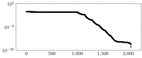


```julia

```


```julia
plungematrix(P,((N,N),(N,N));opts...)
```


    Operator (α₁ - ((α₂ ⊗ α₂) * (α₃ ⊗ α₃) * Ψ₁₅ * Ψ₁₀ * (α₃ ⊗ α₃) * (D₁₇ ⊗ D₁₈))) * (α₂ ⊗ α₂) * (α₃ ⊗ α₃) * Ψ₅
    
    Ψ₉ = (Ψ₈) * D₁₆
    
    Ψ₈ = (D₁₂ * R[1:32 → 𝕀] * D₁₃ * DCT₃) ⊗ (D₁₄ * R[1:32 → 𝕀] * D₁₅ * DCT₄)
    
    Ψ₇ = (Ψ₆) * D₁₁
    
    Ψ₆ = (D₇ * R[1:32 → 𝕀] * D₈ * DCT₁) ⊗ (D₉ * R[1:32 → 𝕀] * D₁₀ * DCT₂)
    
    Ψ₅ = [Ψ₂, 	Ψ₄]
    
    Ψ₄ = D₂₂ * (Ψ₃)
    
    Ψ₃ = (iDCT₇ * D₂₃ * E[ 𝕀 → 1:32]) ⊗ (iDCT₈ * D₂₄ * E[ 𝕀 → 1:32])
    
    Ψ₂ = D₁₉ * (Ψ₁)
    
    Ψ₁₅ = [Ψ₁₂, 	Ψ₁₄]
    
    Ψ₁₄ = D₄ * (Ψ₁₃)
    
    Ψ₁₃ = (iDCT₃ * D₅ * E[ 𝕀 → 1:32]) ⊗ (iDCT₄ * D₆ * E[ 𝕀 → 1:32])
    
    Ψ₁₂ = D₁ * (Ψ₁₁)
    
    Ψ₁₁ = (iDCT₁ * D₂ * E[ 𝕀 → 1:32]) ⊗ (iDCT₂ * D₃ * E[ 𝕀 → 1:32])
    
    Ψ₁₀ = [((D₇ * R[1:32 → 𝕀] * D₈ * DCT₁) ⊗ (D₉ * R[1:32 → 𝕀] * D₁₀ * DCT₂)) * D₁₁;	((D₁₂ * R[1:32 → 𝕀] * D₁₃ * DCT₃) ⊗ (D₁₄ * R[1:32 → 𝕀] * D₁₅ * DCT₄)) * D₁₆]
    
    Ψ₁ = (iDCT₅ * D₂₀ * E[ 𝕀 → 1:32]) ⊗ (iDCT₆ * D₂₁ * E[ 𝕀 → 1:32])
    
    α₃	:	Scaling by 1.0
    α₂	:	Scaling by 0.21984584296868612
    α₁	:	Scaling by 1.0
    Ψ₉	:	CompositeOperator
    Ψ₈	:	TensorProductOperator
    Ψ₇	:	CompositeOperator
    Ψ₆	:	TensorProductOperator
    Ψ₅	:	BlockOperator
    Ψ₄	:	CompositeOperator
    Ψ₃	:	TensorProductOperator
    Ψ₂	:	CompositeOperator
    Ψ₁₅	:	BlockOperator
    Ψ₁₄	:	CompositeOperator
    Ψ₁₃	:	TensorProductOperator
    Ψ₁₂	:	CompositeOperator
    Ψ₁₁	:	TensorProductOperator
    Ψ₁₀	:	BlockOperator
    Ψ₁	:	TensorProductOperator
    iDCT₈	:	FFTW in-place IDCT (DCT-III) plan for 65-element array of Float64
    iDCT₇	:	FFTW in-place IDCT (DCT-III) plan for 65-element array of Float64
    iDCT₆	:	FFTW in-place IDCT (DCT-III) plan for 65-element array of Float64
    iDCT₅	:	FFTW in-place IDCT (DCT-III) plan for 65-element array of Float64
    iDCT₄	:	FFTW in-place IDCT (DCT-III) plan for 65-element array of Float64
    iDCT₃	:	FFTW in-place IDCT (DCT-III) plan for 65-element array of Float64
    iDCT₂	:	FFTW in-place IDCT (DCT-III) plan for 65-element array of Float64
    iDCT₁	:	FFTW in-place IDCT (DCT-III) plan for 65-element array of Float64
    R	:	Restriction of coefficients to subset
    E	:	Extending coefficients by zero padding
    D₉	:	Diagonal operator with element type Float64
    		    ↳ [0.015384615384615385, 0.03076923076923077, 0.03076923076923077  …  0.03076923076923077, 0.03076923076923077, 0.03076923076923077]
    D₈	:	Diagonal operator with element type Float64
    		    ↳ [8.06225774829855, -5.70087712549569, 5.70087712549569  …  5.70087712549569, -5.70087712549569, 5.70087712549569]
    D₇	:	Diagonal operator with element type Float64
    		    ↳ [0.015384615384615385, 0.03076923076923077, 0.03076923076923077  …  0.03076923076923077, 0.03076923076923077, 0.03076923076923077]
    D₆	:	Diagonal operator with element type Float64
    		    ↳ [8.06225774829855, -5.70087712549569, 5.70087712549569  …  5.70087712549569, -5.70087712549569, 5.70087712549569]
    D₅	:	Diagonal operator with element type Float64
    		    ↳ [8.06225774829855, -5.70087712549569, 5.70087712549569  …  5.70087712549569, -5.70087712549569, 5.70087712549569]
    D₄	:	Diagonal operator with element type Float64
    		    ↳ [1.4138006319252818, 1.4121505986054352, 1.40886018544396  …  1.40886018544396, 1.4121505986054352, 1.4138006319252818]
    D₃	:	Diagonal operator with element type Float64
    		    ↳ [8.06225774829855, -5.70087712549569, 5.70087712549569  …  5.70087712549569, -5.70087712549569, 5.70087712549569]
    D₂₄	:	Diagonal operator with element type Float64
    		    ↳ [8.06225774829855, -5.70087712549569, 5.70087712549569  …  5.70087712549569, -5.70087712549569, 5.70087712549569]
    D₂₃	:	Diagonal operator with element type Float64
    		    ↳ [8.06225774829855, -5.70087712549569, 5.70087712549569  …  5.70087712549569, -5.70087712549569, 5.70087712549569]
    D₂₂	:	Diagonal operator with element type Float64
    		    ↳ [1.4138006319252818, 1.4121505986054352, 1.40886018544396  …  1.40886018544396, 1.4121505986054352, 1.4138006319252818]
    D₂₁	:	Diagonal operator with element type Float64
    		    ↳ [8.06225774829855, -5.70087712549569, 5.70087712549569  …  5.70087712549569, -5.70087712549569, 5.70087712549569]
    D₂₀	:	Diagonal operator with element type Float64
    		    ↳ [8.06225774829855, -5.70087712549569, 5.70087712549569  …  5.70087712549569, -5.70087712549569, 5.70087712549569]
    D₂	:	Diagonal operator with element type Float64
    		    ↳ [8.06225774829855, -5.70087712549569, 5.70087712549569  …  5.70087712549569, -5.70087712549569, 5.70087712549569]
    D₁₉	:	Diagonal operator with element type Float64
    		    ↳ [1.0, 1.0, 1.0  …  1.0, 1.0, 1.0]
    D₁₈	:	Diagonal operator with element type Float64
    		    ↳ [4.54864184146723, 4.54864184146723, 4.54864184146723  …  4.54864184146723, 4.54864184146723, 4.54864184146723]
    D₁₇	:	Diagonal operator with element type Float64
    		    ↳ [4.54864184146723, 4.54864184146723, 4.54864184146723  …  4.54864184146723, 4.54864184146723, 4.54864184146723]
    D₁₆	:	Diagonal operator with element type Float64
    		    ↳ [0.4714503930147112, 0.47163351531504055, 0.47199782604803153  …  0.47199782604803153, 0.47163351531504055, 0.4714503930147112]
    D₁₅	:	Diagonal operator with element type Float64
    		    ↳ [8.06225774829855, -5.70087712549569, 5.70087712549569  …  5.70087712549569, -5.70087712549569, 5.70087712549569]
    D₁₄	:	Diagonal operator with element type Float64
    		    ↳ [0.015384615384615385, 0.03076923076923077, 0.03076923076923077  …  0.03076923076923077, 0.03076923076923077, 0.03076923076923077]
    D₁₃	:	Diagonal operator with element type Float64
    		    ↳ [8.06225774829855, -5.70087712549569, 5.70087712549569  …  5.70087712549569, -5.70087712549569, 5.70087712549569]
    D₁₂	:	Diagonal operator with element type Float64
    		    ↳ [0.015384615384615385, 0.03076923076923077, 0.03076923076923077  …  0.03076923076923077, 0.03076923076923077, 0.03076923076923077]
    D₁₁	:	Diagonal operator with element type Float64
    		    ↳ [0.3334631364343788, 0.3339824490254798, 0.33502105526482434  …  0.33502105526482434, 0.3339824490254798, 0.3334631364343788]
    D₁₀	:	Diagonal operator with element type Float64
    		    ↳ [8.06225774829855, -5.70087712549569, 5.70087712549569  …  5.70087712549569, -5.70087712549569, 5.70087712549569]
    D₁	:	Diagonal operator with element type Float64
    		    ↳ [1.0, 1.0, 1.0  …  1.0, 1.0, 1.0]
    DCT₄	:	FFTW in-place DCT (DCT-II) plan for 65-element array of Float64
    DCT₃	:	FFTW in-place DCT (DCT-II) plan for 65-element array of Float64
    DCT₂	:	FFTW in-place DCT (DCT-II) plan for 65-element array of Float64
    DCT₁	:	FFTW in-place DCT (DCT-II) plan for 65-element array of Float64


```julia
s = svdvals(plungematrix(P,((N,N),(N,N));opts...));
```


```julia
wsM = @pgf Axis(axisopts,
        PlotInc(plotopts,Table([collect(1:length(s)),s])))
```


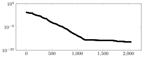


```julia
F = Fun(f,P,((N,N),(N,N)); verbose=true,opts...)
```

    Fun: using the following dictionary:
    Dictionary ω₁(C ⊗ C) ⊕ ω₂(C ⊗ C)
    
    ω₂	:	Weight function: #38
    ω₁	:	Weight function: #37
    C	:	Chebyshev polynomials (first kind)
    		    ↳ length = 32
    		    ↳ Float64 -> Float64
    		    ↳ support = -1.0..1.0 (Chebyshev)
    
    Approximate: using sampling style OversamplingStyle()
    Approximate: using solver style AZStyle()
    Sampling parameter: oversamplingfactor=2, length=1024, M=2048
    Sampling parameter: best match for M = 2048 is L = (46, 46)
    Sampling parameter: oversamplingfactor=2, length=1024, M=2048
    Sampling parameter: best match for M = 2048 is L = (46, 46)
    Sampling parameter: using L = (65, 65)
    
    Approximate: sampling operator with size (4225, Inf) is
    Operator (α ⊗ α) * 𝕊[g × g]
    
    𝕊	:	Discrete sampling operator
    α	:	Scaling by 1.0
    g	:	ChebyshevTNodes of size (65,),	ELT = Float64
    
    
    Sampling parameter: using L = (65, 65)
    Sampling parameter: using L = (65, 65)
    Sampling parameter: using L = (65, 65)
    Sampling parameter: using L = (65, 65)
    Calculating partial QR factorization (LowRankApprox.jl) with `LRAOptions` LowRankApprox.LRAOptions(0.0, -1, -1.0, 32, 1.4901161193847656e-8, "qr", -1, 1.0e-10, :randn, 0, true, LowRankApprox.var"#2#5"(), LowRankApprox.var"#3#6"(), LowRankApprox.var"#4#7"(), 32, true)
    	 Solver truncated at R = 848 dof out of 2048
    Approximate: ended with residual 1.864999849576941e-11
    
    Sampling parameter: using L = (65, 65)


    A 2-dimensional Expansion with 2048 degrees of freedom.
    Basis: Union of dictionaries


```julia
x = EquispacedGrid(100,-1,1)
wsP = plot(F;c=:RdBu,size=(2*300,2*140),layout=2)
wsP = heatmap!(log10.(eps().+abs.(F(x^2)-[f(xi, yi) for xi in x, yi in x]));subplot=2,aspect_ratio=1,ticks=false)
```


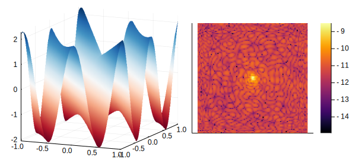


```julia
using Statistics
ns = [1<<k for k in 1:5]
wst = zeros(length(ns),1)
wsNs = [size(AZ_A(P,((n,n),(n,n));opts...),2) for  (i,n) in enumerate(ns)]
@timed(approximate(f,P,((10,10),(10,10));REG=rSVD_solver,opts...))
[wst[i] = getindex(@timed(approximate(f,P,((n,n),(n,n));REG=rSVD_solver,opts...)),2) 
        for (i,n) in enumerate(ns),  j in 1:1]
```


    5×1 Array{Float64,2}:
     0.008575294
     0.018230485
     0.091143963
     0.824217226
     4.42186739 


```julia
wsT = @pgf Axis({sizeopts..., xmode="log",ymode="log",legend_pos="south east"},
        PlotInc(plotopts,Table([ns.^2,median(wst,dims=2)[:]])),
        PlotInc({plotopts..., style="black,dashed",mark="none"},Table([wsNs,1e-5(wsNs).*log.(wsNs)])),
        LegendEntry(L"\mathcal O(N \log(N))"))
```


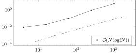


# Weighed on a disk


```julia
f = (x,y) -> cos(2pi*(x+y)) + sqrt(x^2+y^2)*sin(1+2pi*(x+y))
```


    #49 (generic function with 1 method)


```julia
P = FrameFun.ExtensionFramePlatform(WeightedSumPlatform(platform(ChebyshevT(10,-1,1)^2), (x,y)->1., 
        (x,y)->sqrt(x^2+y^2)),.9*UnitDisk())
N = 32;
```

    ┌ Warning: The syntax ChebyshevT(n, a, b) is deprecated. Please use ChebyshevT(n) → a..b instead (the symbol → is \Rightarrow)
    └ @ BasisFunctions /Users/vincentcp/.julia/packages/BasisFunctions/N9rR1/src/bases/poly/chebyshev/ChebyshevT.jl:14


```julia

```


```julia
A = AZ_A(P,((N,N),(N,N)); opts...)
```


    Operator D₁ * R[𝕀 → 𝕀] * [Ψ₂, 	Ψ₄]
    
    Ψ₄ = D₅ * (Ψ₃)
    
    Ψ₃ = (iDCT₃ * D₆ * E[ 𝕀 → 1:32]) ⊗ (iDCT₄ * D₇ * E[ 𝕀 → 1:32])
    
    Ψ₂ = D₂ * (Ψ₁)
    
    Ψ₁ = (iDCT₁ * D₃ * E[ 𝕀 → 1:32]) ⊗ (iDCT₂ * D₄ * E[ 𝕀 → 1:32])
    
    𝕀	:	[CartesianIndex(52, 17), CartesianIndex(53, 17), CartesianIndex(54, 17)  …  CartesianIndex(57, 94), CartesianIndex(58, 94), CartesianIndex(59, 94)]
    Ψ₄	:	CompositeOperator
    Ψ₃	:	TensorProductOperator
    Ψ₂	:	CompositeOperator
    Ψ₁	:	TensorProductOperator
    iDCT₄	:	FFTW in-place IDCT (DCT-III) plan for 110-element array of Float64
    iDCT₃	:	FFTW in-place IDCT (DCT-III) plan for 110-element array of Float64
    iDCT₂	:	FFTW in-place IDCT (DCT-III) plan for 110-element array of Float64
    iDCT₁	:	FFTW in-place IDCT (DCT-III) plan for 110-element array of Float64
    R	:	Restriction of coefficients to subset
    E	:	Extending coefficients by zero padding
    D₇	:	Diagonal operator with element type Float64
    		    ↳ [10.488088481701515, -7.416198487095663, 7.416198487095663  …  -7.416198487095663, 7.416198487095663, -7.416198487095663]
    D₆	:	Diagonal operator with element type Float64
    		    ↳ [10.488088481701515, -7.416198487095663, 7.416198487095663  …  -7.416198487095663, 7.416198487095663, -7.416198487095663]
    D₅	:	Diagonal operator with element type Float64
    		    ↳ [1.4140693734142569, 1.4134928234149051, 1.4123408998377696  …  1.4123408998377696, 1.4134928234149051, 1.4140693734142569]
    D₄	:	Diagonal operator with element type Float64
    		    ↳ [10.488088481701515, -7.416198487095663, 7.416198487095663  …  -7.416198487095663, 7.416198487095663, -7.416198487095663]
    D₃	:	Diagonal operator with element type Float64
    		    ↳ [10.488088481701515, -7.416198487095663, 7.416198487095663  …  -7.416198487095663, 7.416198487095663, -7.416198487095663]
    D₂	:	Diagonal operator with element type Float64
    		    ↳ [1.0, 1.0, 1.0  …  1.0, 1.0, 1.0]
    D₁	:	Diagonal operator with element type Float64
    		    ↳ [0.028559933214452663, 0.028559933214452663, 0.028559933214452663  …  0.028559933214452663, 0.028559933214452663, 0.028559933214452663]


```julia
Zt = AZ_Zt(P,((N,N),(N,N)); opts...)
```


    Operator [Ψ₂;	Ψ₄] * E[ 𝕀 → 𝕀] * D₁₁
    
    Ψ₄ = (Ψ₃) * D₁₀
    
    Ψ₃ = (D₆ * R[1:32 → 𝕀] * D₇ * DCT₃) ⊗ (D₈ * R[1:32 → 𝕀] * D₉ * DCT₄)
    
    Ψ₂ = (Ψ₁) * D₅
    
    Ψ₁ = (D₁ * R[1:32 → 𝕀] * D₂ * DCT₁) ⊗ (D₃ * R[1:32 → 𝕀] * D₄ * DCT₂)
    
    𝕀	:	[CartesianIndex(52, 17), CartesianIndex(53, 17), CartesianIndex(54, 17)  …  CartesianIndex(57, 94), CartesianIndex(58, 94), CartesianIndex(59, 94)]
    Ψ₄	:	CompositeOperator
    Ψ₃	:	TensorProductOperator
    Ψ₂	:	CompositeOperator
    Ψ₁	:	TensorProductOperator
    R	:	Restriction of coefficients to subset
    E	:	Extending coefficients by zero padding
    D₉	:	Diagonal operator with element type Float64
    		    ↳ [10.488088481701515, -7.416198487095663, 7.416198487095663  …  -7.416198487095663, 7.416198487095663, -7.416198487095663]
    D₈	:	Diagonal operator with element type Float64
    		    ↳ [0.00909090909090909, 0.01818181818181818, 0.01818181818181818  …  0.01818181818181818, 0.01818181818181818, 0.01818181818181818]
    D₇	:	Diagonal operator with element type Float64
    		    ↳ [10.488088481701515, -7.416198487095663, 7.416198487095663  …  -7.416198487095663, 7.416198487095663, -7.416198487095663]
    D₆	:	Diagonal operator with element type Float64
    		    ↳ [0.00909090909090909, 0.01818181818181818, 0.01818181818181818  …  0.01818181818181818, 0.01818181818181818, 0.01818181818181818]
    D₅	:	Diagonal operator with element type Float64
    		    ↳ [0.3333786514016568, 0.3335599359587722, 0.33392250426817127  …  0.33392250426817127, 0.3335599359587722, 0.3333786514016568]
    D₄	:	Diagonal operator with element type Float64
    		    ↳ [10.488088481701515, -7.416198487095663, 7.416198487095663  …  -7.416198487095663, 7.416198487095663, -7.416198487095663]
    D₃	:	Diagonal operator with element type Float64
    		    ↳ [0.00909090909090909, 0.01818181818181818, 0.01818181818181818  …  0.01818181818181818, 0.01818181818181818, 0.01818181818181818]
    D₂	:	Diagonal operator with element type Float64
    		    ↳ [10.488088481701515, -7.416198487095663, 7.416198487095663  …  -7.416198487095663, 7.416198487095663, -7.416198487095663]
    D₁₁	:	Diagonal operator with element type Float64
    		    ↳ [35.01408748021698, 35.01408748021698, 35.01408748021698  …  35.01408748021698, 35.01408748021698, 35.01408748021698]
    D₁₀	:	Diagonal operator with element type Float64
    		    ↳ [0.47142054069723077, 0.47148457565645985, 0.4716124101541905  …  0.4716124101541905, 0.47148457565645985, 0.47142054069723077]
    D₁	:	Diagonal operator with element type Float64
    		    ↳ [0.00909090909090909, 0.01818181818181818, 0.01818181818181818  …  0.01818181818181818, 0.01818181818181818, 0.01818181818181818]
    DCT₄	:	FFTW in-place DCT (DCT-II) plan for 110-element array of Float64
    DCT₃	:	FFTW in-place DCT (DCT-II) plan for 110-element array of Float64
    DCT₂	:	FFTW in-place DCT (DCT-II) plan for 110-element array of Float64
    DCT₁	:	FFTW in-place DCT (DCT-II) plan for 110-element array of Float64


```julia
wcA = @pgf Axis(axisopts,PlotInc(plotopts,Table([collect(1:length(s1)),s1])))
```


    UndefVarError: s1 not defined

    

    Stacktrace:

     [1] top-level scope at In[69]:1


```julia
s2 = svdvals(Zt)
wcZ = @pgf Axis(axisopts,PlotInc(plotopts,Table([collect(1:length(s2)),s2])))
```


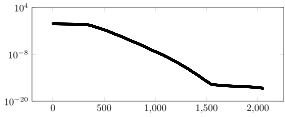


```julia
s3 = svdvals(plungematrix(P,((N,N),(N,N));opts...))
wcM = @pgf Axis(axisopts,PlotInc(plotopts,Table([collect(1:length(s3)),s3])))
```


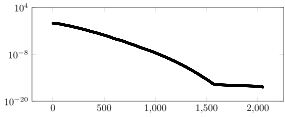


```julia
F = Fun(f, P, ((N,N),(N,N)); verbose=true,opts...)
```

    Fun: using the following dictionary:
    Dictionary 𝔼(ω₁(C ⊗ C) ⊕ ω₂(C ⊗ C))
    
    𝔼	:	Extension frame, from A mapped domain based on the 2-dimensional unit ball to -1.0..1.0 (Chebyshev) x -1.0..1.0 (Chebyshev)
    ω₂	:	Weight function: #52
    ω₁	:	Weight function: #51
    C	:	Chebyshev polynomials (first kind)
    		    ↳ length = 32
    		    ↳ Float64 -> Float64
    		    ↳ support = -1.0..1.0 (Chebyshev)
    
    Approximate: using sampling style OversamplingStyle()
    Approximate: using solver style AZStyle()
    Sampling parameter: using L = (110, 110)
    
    Approximate: sampling operator with size (4168, Inf) is
    Operator D * 𝕊[g × g[𝕀]]
    
    𝕊	:	Discrete sampling operator
    𝕀	:	[CartesianIndex(52, 17), CartesianIndex(53, 17), CartesianIndex(54, 17)  …  CartesianIndex(57, 94), CartesianIndex(58, 94), CartesianIndex(59, 94)]
    g	:	ChebyshevTNodes of size (110,),	ELT = Float64
    D	:	Diagonal operator with element type Float64
    		    ↳ [1.0, 1.0, 1.0  …  1.0, 1.0, 1.0]
    
    
    Sampling parameter: using L = (110, 110)
    Sampling parameter: using L = (110, 110)
    Sampling parameter: using L = (110, 110)
    Sampling parameter: using L = (110, 110)
    Calculating partial QR factorization (LowRankApprox.jl) with `LRAOptions` LowRankApprox.LRAOptions(0.0, -1, -1.0, 32, 1.4901161193847656e-8, "qr", -1, 1.0e-10, :randn, 0, true, LowRankApprox.var"#2#5"(), LowRankApprox.var"#3#6"(), LowRankApprox.var"#4#7"(), 32, true)
    	 Solver truncated at R = 1216 dof out of 2048
    Approximate: ended with residual 8.296988472498953e-11
    
    Sampling parameter: using L = (110, 110)


    A 2-dimensional Expansion with 2048 degrees of freedom.
    Basis: Extension frame


```julia
g = PeriodicEquispacedGrid(100,-.9,.9)^2;
y = F(g);
```


```julia
x = EquispacedGrid(100,-1,1)
wcP = plot(F;c=:RdBu,size=(2*300,2*140),layout=2)
wcP = heatmap!(log10.(eps().+abs.(F(x^2)-[f(xi, yi) for xi in x, yi in x]));subplot=2,aspect_ratio=1,ticks=false)
```


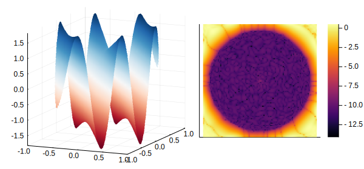


```julia
using Statistics
ns = [1<<k for k in 1:5]
wct = zeros(length(ns),1)
wcNs = [size(AZ_A(P,((n,n),(n,n));opts...),2) for  (i,n) in enumerate(ns)]
@timed(approximate(f,P,((10,10),(10,10));REG=rSVD_solver,opts...))
[wct[i] = getindex(@timed(approximate(f,P,((n,n),(n,n));REG=rSVD_solver,opts...)),2) 
        for (i,n) in enumerate(ns),  j in 1:1]
```


    5×1 Array{Float64,2}:
      0.009074852
      0.02817778 
      0.246283375
      1.2467424  
     13.292944353


```julia
wcT = @pgf Axis({sizeopts..., xmode="log",ymode="log",legend_pos="south east"},
    PlotInc(plotopts,Table([wcNs,median(wct,dims=2)[:]])),
        PlotInc({plotopts..., style="black,dashed",mark="none"},Table([wcNs,1e-5(wcNs).^2])),
        LegendEntry(L"\mathcal O(N^2)"))
```


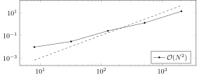


```julia

```


```julia

```


```julia

```
